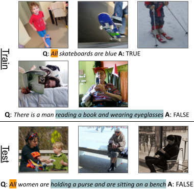

# COVR: A Test-Bed for Visually Grounded Compositional Generalization with Real Images

**COVR** is a test-bed for visually-grounded compositional generalization with real images. You can use COVR to train Visual Question Answering (VQA) models and evaluate it on various compositional tests, and possibly create your own new compositional splits. 

See [our paper](https://arxiv.org/pdf/2109.10613) for details, and the [dataset webpage](https://covr-dataset.github.io/) for the leaderboard and other details.

## Download dataset

The dataset is available at this link:
* [Download dataset](https://drive.google.com/file/d/10xlQ6isRdGX94BypoqN6klniGeqdLBJA/view?usp=sharing)

## Running experiments

Please see the following page for code and instructions on how to reproduce our results: 
* [Running experiments](experiments)

## Creating more splits
Please see the following page for code and instructions on how to create new splits:
* [Compositionally Splitting COVR](splits)

## Generating samples and extending the dataset
This will be available soon!
